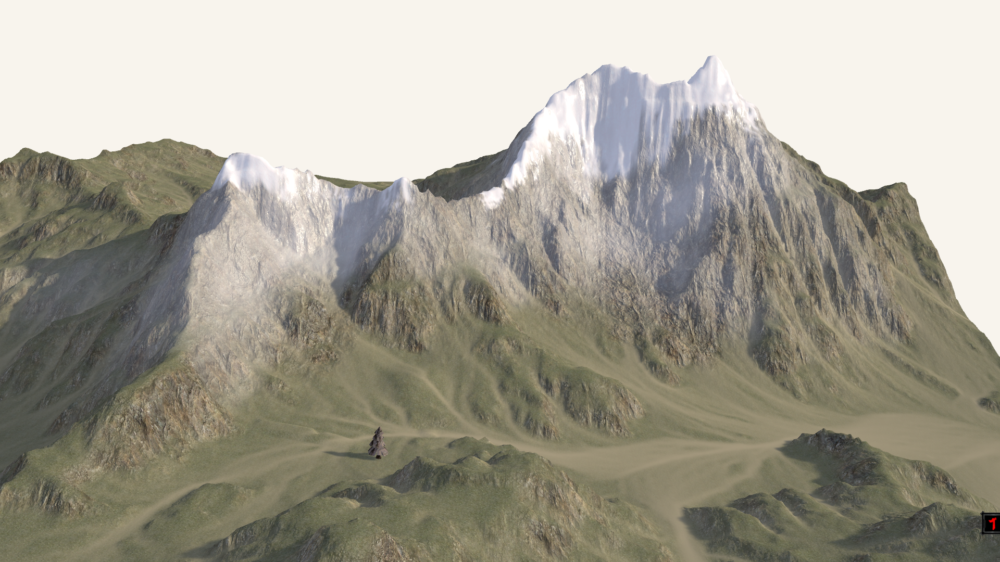

# 3D_mountain
## Installation
To run this application, download the GitHub zip file or clone the repository. Then open a browsser window and run the 3D_mountain.exe file .

### The source code and assets are not public.

## Overview
Designing a snowy mountain with Unity Engine 3D game engine.

## Gameview

